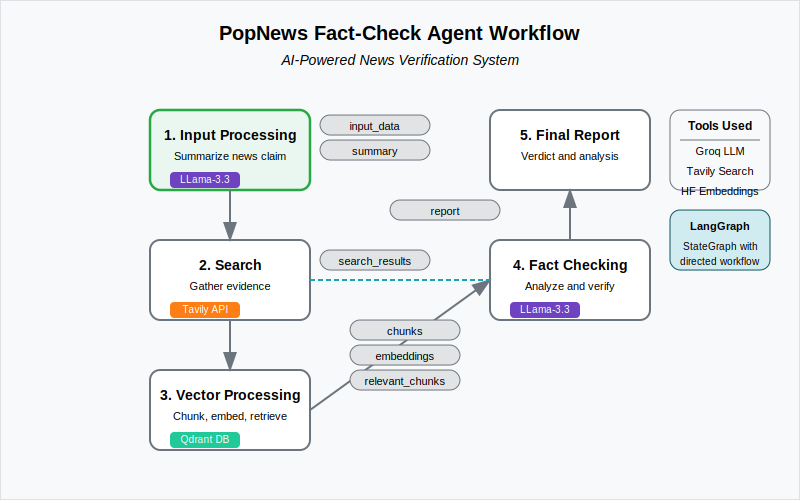

# PopNews Monorepo

A comprehensive fake news detection platform with AI-powered analysis and real-time verification.


## 📋 Project Overview

PopNews is an innovative fake news detection platform that leverages artificial intelligence to enhance content verification. The platform enables users to validate news articles and social media content, with the option to deploy AI agents that can analyze information based on customized verification strategies and knowledge bases.

### Key Features

- **AI-Powered Detection**: Deploy intelligent agents to analyze content based on factual databases
- **Real-time Content Analysis**: Monitor news trends and misinformation patterns
- **Source Credibility Assessment**: Multi-factor evaluation of information sources
- **User Feedback Learning**: Agents that adapt to evolving misinformation tactics over time
- **Multi-platform Support**: Web, mobile, and API access for seamless integration

## 🏗️ Architecture

This project is organized as a monorepo containing both frontend and backend code, with shared utilities and models accessible to both.



### Frontend

The frontend is built using React with TypeScript, providing a responsive and interactive user interface for content verification and monitoring.

Key components:

- **User Dashboard**: Track analyzed content and verification results
- **Content Scanner**: Submit and process news articles and social media posts
- **Analysis Interface**: Detailed breakdown of fact-checking results
- **Agent Configuration**: Set up and customize AI verification agents

### Backend

The backend is powered by Node.js with Express, providing RESTful APIs and WebSocket connections for real-time updates.

Key components:

- **Authentication Service**: Secure user management and access control
- **Detection Engine**: Core analysis logic for content verification
- **Data Processing**: Natural language processing and semantic analysis
- **AI Agent System**: Intelligent verification assistant implementation

### AI Agent System

The AI agents operate within a sophisticated workflow:

1. **Agent Manager**: Coordinates agent activities and resource allocation
2. **Task Queue**: Prioritizes and schedules verification tasks
3. **LLM Interface**: Connects to language models for content analysis
4. **Knowledge Base**: Stores factual information and known misinformation patterns
5. **Strategy Engine**: Implements verification algorithms based on content types

## 🚀 Getting Started

### Prerequisites

- Node.js 16.x or higher
- MongoDB 5.x
- Redis (for caching and pub/sub)

### Installation

1. Clone the repository:

   ```bash
   git clone https://github.com/yourusername/popnews-mono-repo.git
   cd popnews-mono-repo
   ```

2. Install dependencies:

   ```bash
   npm install
   ```

3. Set up environment variables:

   ```bash
   cp .env.example .env
   # Edit .env with your configuration
   ```

4. Start development servers:
   ```bash
   npm run dev
   ```

### Project Structure

```
popnews-mono-repo/
├── backend/              # Server-side code
│   ├── config/           # Configuration files
│   ├── controllers/      # Request handlers
│   ├── models/           # Data models
│   ├── routes/           # API endpoints
│   ├── services/         # Business logic
│   ├── agents/           # AI verification agents
│   │   ├── manager.js    # Agent coordination
│   │   ├── strategies/   # Analysis algorithms
│   │   └── llm/          # Language model integration
│   └── utils/            # Helper functions
│
├── frontend/             # Client-side code
│   ├── public/           # Static assets
│   ├── src/              # React application
│   │   ├── components/   # Reusable UI components
│   │   ├── pages/        # Route components
│   │   ├── services/     # API clients
│   │   ├── state/        # State management
│   │   └── utils/        # Helper functions
│   └── tests/            # Frontend tests
│
├── shared/               # Code shared between frontend and backend
│   ├── constants/        # Shared constants
│   ├── types/            # TypeScript definitions
│   └── utils/            # Common utilities
│
├── scripts/              # Build and deployment scripts
├── docs/                 # Documentation
├── project-structure.svg # Architecture diagram
└── agent-workflow.svg    # AI agent workflow diagram
```

## 🧠 AI Agent System

The AI agent system is the heart of PopNews, providing intelligent content verification capabilities based on multiple knowledge sources and analytical techniques.

### Agent Workflow

1. **Content Intake**: The system processes submitted articles, posts, or media
2. **Source Analysis**: Information sources are evaluated for credibility
3. **Fact Extraction**: Key claims are identified and isolated for verification
4. **Evidence Collection**: Relevant facts are gathered from trusted databases
5. **Claim Verification**: Claims are evaluated against collected evidence
6. **Report Generation**: Detailed analysis results are formatted for user review

### Agent Types

- **Source Validator**: Specializes in evaluating the credibility of information sources
- **Fact Checker**: Cross-references claims against verified factual databases
- **Language Analyzer**: Identifies linguistic patterns associated with misinformation
- **Trend Detector**: Spots emerging misinformation campaigns across platforms

## 📈 Development Roadmap

- [x] Core verification functionality
- [x] Basic AI agent implementation
- [ ] Advanced detection strategies
- [ ] Machine learning model for pattern recognition
- [ ] Mobile application support
- [ ] API ecosystem for third-party integration

## 🤝 Contributing

Contributions are welcome! Please feels free to submit a Pull Request.

1. Fork the repository
2. Create your feature branch (`git checkout -b feature/amazing-feature`)
3. Commit your changes (`git commit -m 'Add some amazing feature'`)
4. Push to the branch (`git push origin feature/amazing-feature`)
5. Open a Pull Request

## 📄 License

This project is licensed under the MIT License - see the LICENSE file for details.

## 📞 Contact

For questions and support, please reach out to the development team at dev@popnews.example.com
